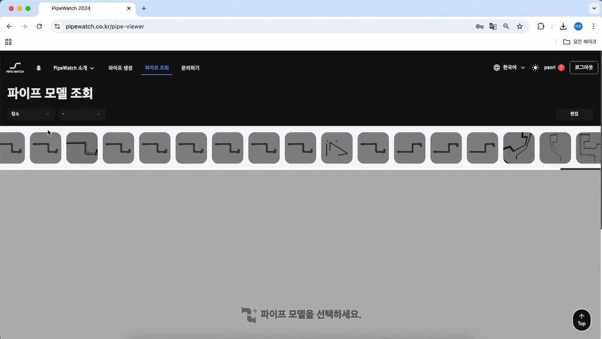
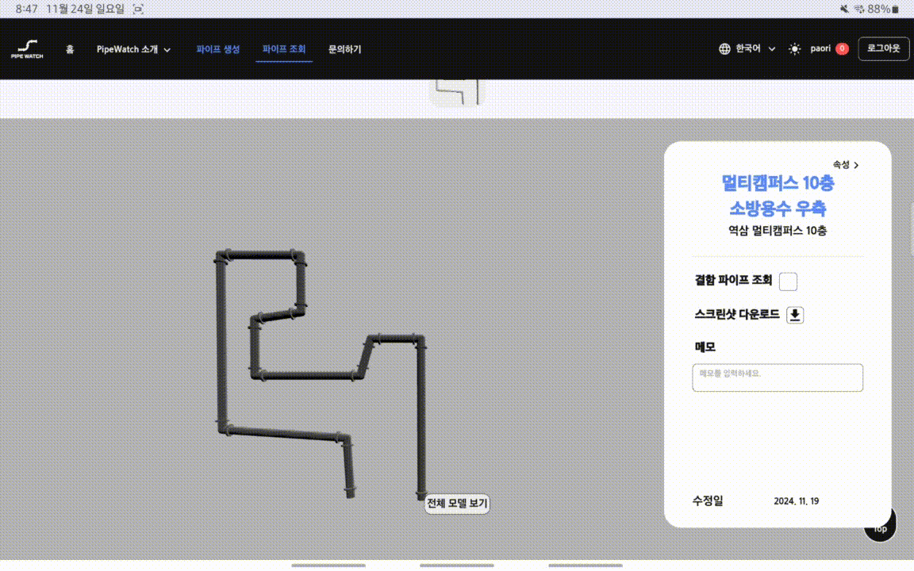

### 🏆 **삼성 청년 SW 아카데미(SSAFY) 11기 - 자율 우수 프로젝트 (결선 3등)**

 

# 📝 PipeWatch

**PipeWatch**는 AI를 통해 공장의 파이프를 스캔하여 파이프의 관리 및 유지보수를 돕는 디지털 트윈 서비스입니다.

사용자들은 파이프를 사진 및 업로드하여 변환된 3D 모델링으로 파이프를 관리하고, 재질 및 결함 여부를 관리할 수 있습니다.

 

## 📱 서비스 화면

### 📄 파이프 모델 생성

- 카메라나 사진 업로드를 통해 파이프 모델을 생성할 수 있습니다.
- 해당 파이프에 대한 데이터를 입력하여 조회 시 그룹화를 통해 확인이 가능합니다.

<table>
<tr>
    <td align="center">
        
        
<strong>파이프 모델 업로드</strong>

    </td>
    <td align="center">
        
        
<strong>파이프 데이터 입력</strong>

    </td>
</tr>
<tr>
	<td align="center">
        
        
<strong>모델 렌더링</strong>

    </td>
	<td align="center">
        
        
<strong>모델 생성 완료</strong>

    </td>
</tr>
</table>

---

### 🎨 파이프 모델 조회

- 장소를 기준으로 그룹화된 모델을 조회 가능합니다.
- 3D 모델링으로 변환된 파이프 모델을 확인할 수 있습니다.
- 해당 파이프에 대한 메모 및 속성 관리가 가능합니다.

<table>
<tr>
    <td align="center">
        
        
<strong>모델 조회</strong>

    </td>
</tr>
</table>

### 🆎 파이프 결함 관리

- 파이프의 부분에 대한 메모 및 결함 체크가 가능합니다.
- 결함 체크를 통해 어떤 부분에 결함이 발생했는지 확인할 수 있습니다.

<table>
<tr>
    <td align="center">
        
        
<strong>결함 파이프 관리</strong>

    </td>
</tr>
</table>

 

## ⚒️ 기술 스택

### 🖥️ Client

### 🖥️ Server

### 🖥️ AI

### 🖥️ Model

### 🖥️ Devops

### 🖥️ Common

---
